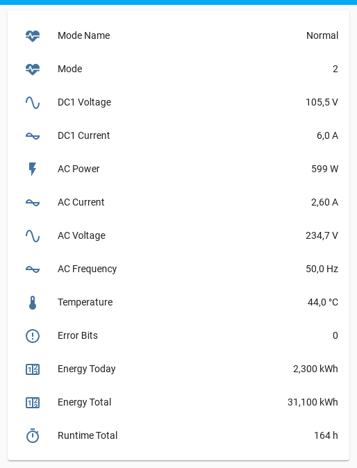

# esphome-solax-x1-mini


[](https://www.buymeacoffee.com/syssi)

ESPHome component to monitor a Solax X1 mini via RS485.



## Supported devices

* SolaX X1 Mini
  - SolaX X1 Mini X1-0.6-S-D(L)
* SolaX X1 Mini G2
  - SolaX X1 Mini X1-1.5-S-D(L) (master version 1.08, manager version 1.07) (reported by [@beocycris](https://github.com/syssi/esphome-solax-x1-mini/issues/18#issuecomment-1073188868))
  - SolaX X1 Mini X1-2.0-S-D(L) (master version 1.08, manager version 1.07) (reported by [@zcloud-at](https://github.com/syssi/esphome-solax-x1-mini/issues/15))
* SolaX X1 Mini G3
  - SolaX X1 Mini X1-0.6-S-D(L) (master version 1.08, manager version 1.07) (reported by [@neujbit](https://github.com/syssi/esphome-solax-x1-mini/issues/22))

## Requirements

* [ESPHome 2024.6.0 or higher](https://github.com/esphome/esphome/releases).
* One half of an ethernet cable with RJ45 connector
* RS485-to-TTL module (`HW-0519` f.e.)
* Generic ESP32 or ESP8266 board

## Schematics

#### RS485-TTL module without flow control pin

```
               RS485                        UART
┌─────────┐              ┌─────────────┐           ┌─────────────────┐
│         │              │          GND│<--------->│GND              │
│  Solax  │<-----B- ---->│  RS485   RXD│<--------->│RX    ESP32/     │
│ X1 Mini │<---- A+ ---->│  to TTL  TXD│<--------->│TX    ESP8266    │
│         │<--- GND ---->│  module  VCC│<--------->│3.3V          VCC│<--
│         │              │             │           │              GND│<--
└─────────┘              └─────────────┘           └─────────────────┘

```

#### RS485-TTL module with flow control pin

```
               RS485                        UART
┌─────────┐              ┌─────────────┐           ┌─────────────────┐
│         │              │           DI│<--------->│TX               │
│  Solax  │<-----B- ---->│  RS485    DE│<--\       │         ESP32/  │
│ X1 Mini │<---- A+ ---->│  to TTL   RE│<---+----->│GPIO0   ESP8266  │
│         │<--- GND ---->│  module   RO│<--------->│RX               │
│         │              │             │           │                 │
│         │              │          VCC│<--------->│3.3V          VCC│<--
│         │              │          GND│<--------->│GND           GND│<--
└─────────┘              └─────────────┘           └─────────────────┘

```

Please make sure to power the RS485 module with 3.3V because it affects the TTL (transistor-transistor logic) voltage between RS485 module and ESP.

### X1 Mini RJ45 connector

| Pin     | Purpose      | RS485-to-TTL pin  | Color T-568B |
| :-----: | :----------- | :---------------- | ------------ |
|    1    | RefGen       |                   |              |
|    2    | Com/DRM0     |                   |              |
|    3    | GND_COM      |                   |              |
|    4    | **A+**       | **A+**            | Blue         |
|    5    | **B-**       | **B-**            | Blue-White   |
|    6    | E_Stop       |                   |              |
|    7    | **GND_COM**  | **GND**           | Brown-White  |
|    8    | --           |                   |              |

## Installation

You can install this component with [ESPHome external components feature](https://esphome.io/components/external_components.html) like this:
```yaml
external_components:
  - source: github://syssi/esphome-solax-x1-mini@main
```

or just use the `esp32-example.yaml` / `esp8266-example.yaml` as proof of concept:

```bash
# Install esphome
pip3 install esphome

# Clone this external component
git clone https://github.com/syssi/esphome-solax-x1-mini.git
cd esphome-solax-x1-mini

# Create a secrets.yaml containing some setup specific secrets
cat > secrets.yaml <<EOF
wifi_ssid: MY_WIFI_SSID
wifi_password: MY_WIFI_PASSWORD

mqtt_host: MY_MQTT_HOST
mqtt_username: MY_MQTT_USERNAME
mqtt_password: MY_MQTT_PASSWORD
EOF

# Validate the configuration, create a binary, upload it, and start logs
# If you use a esp8266 run the esp8266-examle.yaml
esphome run esp32-example.yaml

```

For a more advanced setup take a look at the [esp32-example-advanced-multiple-uarts.yaml](esp32-example-advanced-multiple-uarts.yaml).

## Known issues

All known firmware versions (`V1.00`) responds with the same serial number (`3132333435363737363534333231`) to the discovery 
broadcast (`AA.55.01.00.00.00.10.00.00.01.10`). For this reason it's challenging to use multiple devices on the same bus and 
assign an individual address per device.

Affected firmware versions:

* 618.00207.00_X1_BOOST3.0_MINI2.0_AIR2.0_ARM_V1.32_20210625.usb, 618.00381.00_X1_BOOST3.0_MINI2.0_AIR2.0_DSP_V2.12_20210622.usb

Workaround: Use one UART per device to handle multiple devices.

## Debugging

If this component doesn't work out of the box for your device please update your configuration to enable the debug output of the UART component and increase the log level to the see outgoing and incoming serial traffic:

```
logger:
  level: VERY_VERBOSE
  logs:
    scheduler: DEBUG
    component: DEBUG

uart:
  id: uart_0
  baud_rate: 9600
  tx_pin: GPIO4
  rx_pin: GPIO5
  debug:
    direction: BOTH
```

## Protocol details

### Discovery

```
# Send discovery to broadcast address (0x10 0x00)
[VV][solax_modbus:200]: TX -> AA.55.01.00.00.00.10.00.00.01.10 (11)
[VV][solax_modbus:084]: RX <- AA.55.00.FF.01.00.10.80.0E.31.32.33.34.35.36.37.37.36.35.34.33.32.31.05.75 (25)
                                                         ^^^^^^^^^^^^^^^^^^^^^^^^^^^^^^^^^^^^^^^^^
[I][solax_modbus:105]: Inverter discovered. Serial number: 3132333435363737363534333231

# Assign address (0x0A) to the inverter via serial number (0x10, 0x01)
[VV][solax_modbus:200]: TX -> AA.55.00.00.00.00.10.01.0F.31.32.33.34.35.36.37.37.36.35.34.33.32.31.0A.04.01 (26)
                                                         ^^^^^^^^^^^^^^^^^^^^^^^^^^^^^^^^^^^^^^^^^^^^
                                                   Byte   0  1  2  3  4  5  6  7  8  9 10 11 12 13 14

# Register address confirmation (0x10, 0x81)
[VV][solax_modbus:084]: RX <- AA.55.00.0A.00.00.10.81.01.06.01.A1 (12)
                                                    ^
                                                    ACK
```

### Request device infos

```
# Request info (0x11 0x03)
[18:13:12][VV][solax_modbus:214]: TX -> AA.55.01.00.00.0A.11.03.00.01.1E (11)

# Response (0x11 0x83)
[18:13:12][VV][solax_modbus:084]: RX <- AA.55.00.0A.01.00.11.83.3A.01.00.00.00.00.00.00.56.31.2E.30.30.20.20.20.20.20.20.20.20.20.20.20.20.20.20.73.6F.6C.61.78.20.20.20.20.20.20.20.20.20.58.4D.55.30.36.32.47.43.30.39.33.35.34.30.33.36.30.30.0C.0F (69)
                                                                   ^^^^^^^^^^^^^^^^^^^^^^^^^^^^^^^^^^^^^^^^^^^^^^^^^^^^^^^^^^^^^^^^^^^^^^^^^^^^^^^^^^^^^^^^^^^^^^^^^^^^^^^^^^^^^^^^^^^^^^^^^^^^^^^^^^^^^^^^^^^^^^^^^^^^^^^^^^^^^^^^^^^^^^^^^^^^^

Data  0      (device type?):      0x01 (single phase)
Data  1...6  (rated power):       0x00 0x00 0x00 0x00 0x00 0x00 ()
Data  7...11 (firmware version):  0x56 0x31 0x2E 0x30 0x30 (V1.00)
Data 12...25 (module name):       0x20 0x20 0x20 0x20 0x20 0x20 0x20 0x20 0x20 0x20 0x20 0x20 0x20 0x20 ( )
Data 26...39 (factory name):      0x73 0x6F 0x6C 0x61 0x78 0x20 0x20 0x20 0x20 0x20 0x20 0x20 0x20 0x20 (solax )
Data 40...53 (serial number):     0x58 0x4D 0x55 0x30 0x36 0x32 0x47 0x43 0x30 0x39 0x33 0x35 0x34 0x30 (XMU062GC093540)
Data 54...57 (rated bus voltage): 0x33 0x36 0x30 0x30 (3600)
```

### Request live data

```
# Request live data (0x11 0x02)
[18:15:15][VV][solax_modbus:214]: TX -> AA.55.01.00.00.0A.11.02.00.01.1D (11)

# Response (0x11 0x82)
[18:15:15][VV][solax_modbus:214]: RX <-
AA.55.00.0A.01.00.11.82.34.00.19.00.01.02.46.00.00.00.0A.00.00.00.05.09.13.13.87.00.32.FF.FF.00.00.00.11.00.00.00.14.00.02.00.00.00.00.00.00.00.00.00.00.00.00.00.00.00.00.00.00.02.D0.06.21 (63)
                           ^^^^^^^^^^^^^^^^^^^^^^^^^^^^^^^^^^^^^^^^^^^^^^^^^^^^^^^^^^^^^^^^^^^^^^^^^^^^^^^^^^^^^^^^^^^^^^^^^^^^^^^^^^^^^^^^^^^^^^^^^^^^^^^^^^^^^^^^^^^^^^^^^^^^^^^^^^^

Data  0...1  (temperature):        0x00 0x19 (25 C)
Data  2...3  (energy today):       0x00 0x01 (0.1 kWh)
Data  4...5  (pv1 voltage):        0x02 0x46 (58.2 V)
Data  6...7  (pv2 voltage):        0x00 0x00 (0.0 V)
Data  8...9  (pv1 current):        0x00 0x0A (1.0 A)
Data 10...11 (pv2 current):        0x00 0x00 (0.0 A)
Data 12...13 (ac current):         0x00 0x05 (0.5 A)
Data 14...15 (ac voltage):         0x09 0x13 (232.3V)
Data 16...17 (ac frequency):       0x13 0x87 (49.99 Hz)
Data 18...19 (ac power):           0x00 0x32 (50 W)
Data 20...21 (unused):             0xFF 0xFF
Data 22...25 (energy total):       0x00 0x00 0x00 0x11 (0.1 kWh)
Data 26...29 (runtime total):      0x00 0x00 0x00 0x14 (20 h)
Data 30...31 (mode):               0x00 0x02 (2: Normal)
Data 32...33 (grid voltage fault): 0x00 0x00 (0.0 V)
Data 34...35 (grid freq. fault)    0x00 0x00 (0.00 Hz)
Data 36...37 (dc injection fault): 0x00 0x00 (0 mA)
Data 38...39 (temperature fault):  0x00 0x00 (0 °C)
Data 40...41 (pv1 voltage fault):  0x00 0x00 (0 V)
Data 42...43 (pv2 voltage fault):  0x00 0x00 (0 V)
Data 44...45 (gfc fault):          0x00 0x00 (0 mA)
Data 46...49 (error message):      0x00 0x00 0x00 0x00 (No error)
Data 50...52 (ct pgrid):           0x02 0xD0 (720 W)

```

## References

* https://github.com/JensJordan/solaXd/
* https://github.com/arendst/Tasmota/blob/development/tasmota/xnrg_12_solaxX1.ino
* https://github.com/esphome/esphome/blob/dev/esphome/components/modbus/modbus.cpp
* https://github.com/syssi/esphome-solax-x1-mini/blob/main/docs/SolaxPower_Single_Phase_External_Communication_Protocol_-_X1_Series_V1.2.pdf
